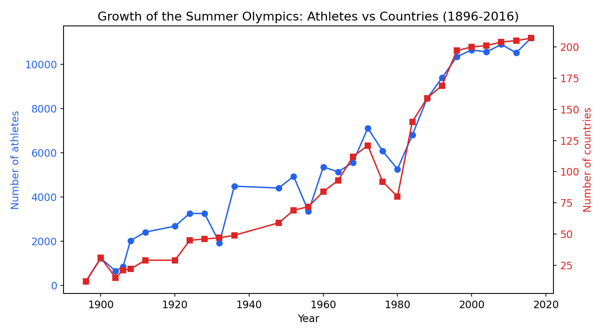
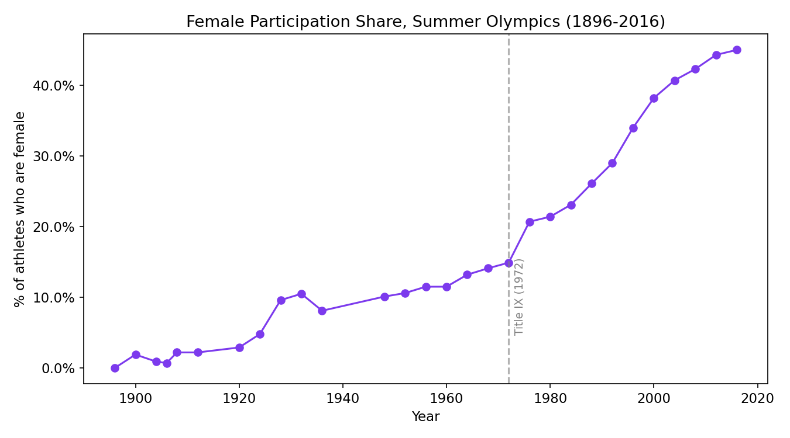
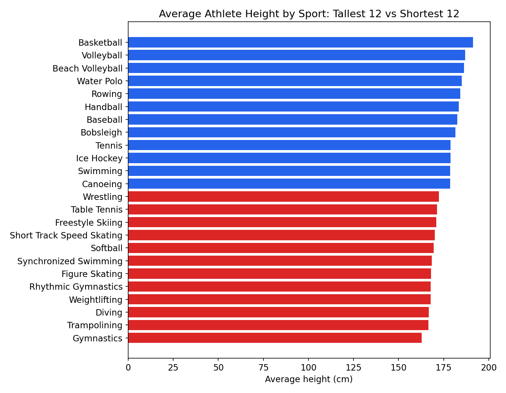
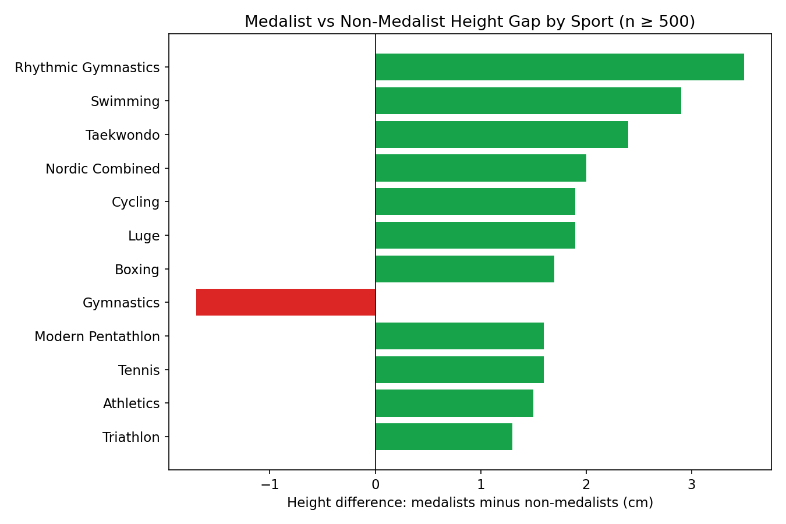

# 120 Years of Olympic History — SQL Analysis

A SQL-driven exploratory analysis of the [120 Years of Olympic History: Athletes and Results](https://www.kaggle.com/datasets/heesoo37/120-years-of-olympic-history-athletes-and-results) dataset (271,116 athlete-event records, 1896–2016), examining how the Games have grown, how female participation has evolved, and how athlete physiology varies by sport and medal outcome.

## Overview

- **Dataset:** `athlete_events.csv` (athlete demographics, event, medal outcome) joined to `noc_regions.csv` (country mapping), sourced from Kaggle
- **Stack:** PostgreSQL for querying/aggregation, Python (pandas, SQLAlchemy, matplotlib) for data loading and visualization
- **Scope:** Growth trends over time, female participation trends, physical attributes by sport, medalist vs. non-medalist comparison

## Methodology

Data was loaded into PostgreSQL via a Python/pandas + SQLAlchemy script rather than a GUI import tool, to handle the dataset's `"NA"` string placeholders and avoid schema-inference issues (e.g. auto-generated `varchar(50)` columns truncating longer athlete names and event names). Analysis was performed with SQL aggregations, window functions (`LAG`, `RANK`), and `FILTER`-based conditional aggregation, then visualized in Python.

## Findings

### 1. Growth of the Games: explosive expansion, then a plateau

From 1896 to 2016, the Summer Olympics grew from 176 athletes representing 12 countries to 11,179 athletes representing 207 countries — a **63x increase in athletes** and a **17x increase in participating countries**.



That growth, however, was front-loaded. Athlete headcount has been essentially flat since 1996:

| Year | Athletes | Countries |
| ---- | -------- | --------- |
| 1996 | 10,339   | 197       |
| 2000 | 10,647   | 200       |
| 2004 | 10,557   | 201       |
| 2008 | 10,899   | 204       |
| 2012 | 10,517   | 205       |
| 2016 | 11,179   | 207       |

The IOC has effectively capped Games size at roughly ~10,500–11,200 athletes for two decades. Growth since the mid-90s has come almost entirely from added _events_ (271 → 306), not more athletes — the Games have gotten more diverse, not bigger.

### 2. Female participation: from 0% to near parity

Women were entirely absent from the first modern Olympics (Athens, 1896). Participation crept up slowly through the early-to-mid 20th century, then accelerated sharply from the 1970s onward:



- **1896–1920:** near-zero, under 3%
- **1924–1936:** first real jump, ~3% → 10%, as more sports opened to women
- **1948–1972:** slow, steady climb, ~10% → 15%
- **1976–2016:** sustained, uninterrupted growth — 20.7% → 45.0% — coinciding with the post–Title IX (1972) push for gender equity in sport globally

Notably, this is the one metric in the dataset that kept climbing every single edition even after total athlete headcount plateaued in the 1990s — the pie stopped growing, but the split kept shifting.

### 3. Physical attributes by sport

Average athlete height varies by roughly 28cm across sports, from Basketball (191.2cm avg) down to Gymnastics (162.9cm avg) — an intuitive but striking range once visualized:



Team/power sports (Basketball, Volleyball, Water Polo, Rowing) cluster at the tall end; sports rewarding low body mass and agility (Gymnastics, Diving, Rhythmic Gymnastics, Figure Skating) cluster at the short end.

### 4. Do medalists differ physically from non-medalists?

Comparing medalists to non-medalists within each sport, filtered to sports with at least 500 athlete-events (to exclude noise from small samples like Golf or Tug-of-War, which had wildly swinging but statistically unreliable gaps):



| Sport      | Medalist avg height | Non-medalist avg height | Difference | Sample size |
| ---------- | ------------------- | ----------------------- | ---------- | ----------- |
| Swimming   | 181.1cm             | 178.2cm                 | +2.9cm     | 18,776      |
| Athletics  | 177.6cm             | 176.1cm                 | +1.5cm     | 32,374      |
| Cycling    | 177.9cm             | 176.0cm                 | +1.9cm     | 7,775       |
| Tennis     | 180.4cm             | 178.8cm                 | +1.6cm     | 2,008       |
| Boxing     | 174.3cm             | 172.6cm                 | +1.7cm     | 4,363       |
| Gymnastics | 161.3cm             | 163.0cm                 | **−1.7cm** | 18,271      |

In most sports with large sample sizes, medalists skew slightly taller than non-medalists — a small but consistent edge (1.5–2.9cm) in Swimming, Athletics, Cycling, Tennis, and Boxing. Gymnastics is a notable exception: medalists are _shorter_ than non-medalists, consistent with the sport favoring smaller body types for power-to-weight ratio and rotational control.

These gaps are modest relative to the within-sport height spread (typical standard deviation of 8–11cm), so they should be read as a mild statistical tendency rather than a hard predictor of medal success — sample size, not just the size of the gap, is what makes the large-sport findings (Swimming, Athletics) more trustworthy than small-sample outliers.

## Limitations

- Height/weight/age fields have missing values for a meaningful share of historical records, particularly pre-1960s
- Team events count each roster member as a separate row, which inflates per-country medal totals if not deduplicated (relevant for any follow-up country-level analysis, not the sections above)
- The dataset ends at Rio 2016 and does not include Tokyo 2020/Beijing 2022 or later Games

## Repository structure

```
.
├── README.md
├── images/
│   ├── 01_growth_of_games.png
│   ├── 02_female_participation.png
│   ├── 03_height_by_sport.png
│   └── 04_medalist_height_gap.png
└── sql/
    └── queries.sql
└── outputs/
│   ├── Female Particpation.csv
│   ├── Growth of the Games — athletes, countries, events per edition.csv
│   ├── height weight spread fro medalist vs non meadlist.csv
│   ├── height weight spread.csv


```

## Tools

PostgreSQL · Python (pandas, SQLAlchemy, matplotlib) · SQL window functions & conditional aggregation
